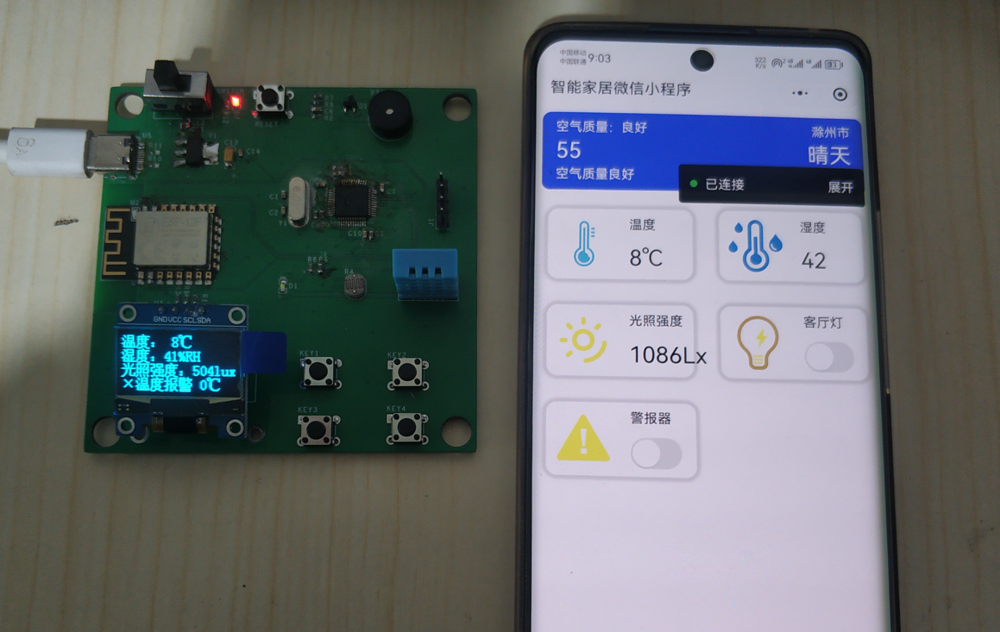

> 项目是一个基于STM32、ESP8266及微信小程序的MQTT物联网家居学习Demo。通过STM32端采集室内环境，将数据上传至MQTT服务器，并由微信小程序进行订阅，实时显示。

## 硬件部分

* 硬件部分在**1.Hardware**文件夹;
* 主要采用STM32F103C8T6、ESP12-F、I2C OLED、蜂鸣器、LED等设计；
* PCB使用allegro17.4设计，可以作为参考。

## 软件部分

* STM32F103使用MDK开发，源代码在**2.Code/STM32**文件夹；
* 微信小程序开发需要注册小程序账户，源代码在**2.Code/WeChat**文件夹；

## 参考链接

项目是在其它开源项目基础上进行制作的，在此表示感谢！！！如有学习需要，可以查看下列链接：

* [MQTT项目教学](https://www.bilibili.com/video/BV1wq4y1U79y/?spm_id_from=333.788&vd_source=14a3fe836cc8fb4a016ce84f165c0472)
* [太极创客](http://www.taichi-maker.com/homepage/esp8266-nodemcu-iot/iot-tuttorial/)

